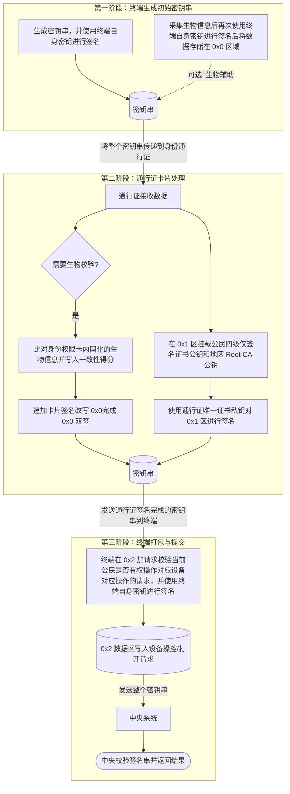

+++
title = "身份通行证"

category = ["物品"]
+++

## 获取

年满 8 岁的公民可获得“身份通行证”，未满足的则追加授权到监护人的权限授权中。

获取/更换需到对应地区指定地点校验身份和采集信息后等待现场制作。

## 用处

可用于校验公民身份，有时可配合生物特征协助校验。
也可用于获取公民基本信息，但敏感信息必须配合生物特征获取。

## 特征

身份通行证仅进行签名许可，内置固化了密钥的高速密码学计算器和能衰变水晶（用于获取时间）。

固化内容：

- 公民的四级”仅签名“证书公钥
- 身份通行证唯一证书公钥
- 地区 Root CA 公钥
- 基本生物散列值

## 使用

### 作为权限卡使用

校验终端必须在中央进行备案。

步骤如下：

TODO：所有操作应该有时间信息，但是这里没写上去

